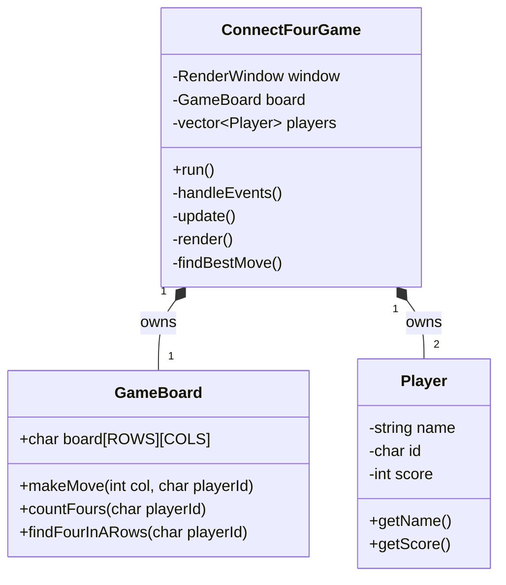

# بازی Connect 4 با C++ و SFML

این پروژه یک پیاده‌سازی کامل از بازی کلاسیک **Connect 4** است که با استفاده از زبان `C++` و کتابخانه گرافیکی `SFML` ساخته شده است. این نسخه از پروژه بازسازی شده و دارای ساختاری ماژولار، هوش مصنوعی بهبودیافته و تجربه کاربری بهتر است.

## ✨ ویژگی‌های کلیدی

-   **رابط کاربری گرافیکی (GUI):** یک رابط کاربری کامل با منوی اصلی، صفحه بازی و نمایش امتیازات.
-   **دو حالت بازی:**
    -   بازیکن در مقابل بازیکن (Player vs. Player)
    -   بازیکن در مقابل کامپیوتر (Player vs. Computer)
-   **هوش مصنوعی بهبودیافته:** هوش مصنوعی علاوه بر شمارش خطوط، از استراتژی کنترل مرکز صفحه نیز استفاده می‌کند.
-   **تجربه کاربری بهتر:** مهره‌های تشکیل‌دهنده ردیف‌های برنده در پایان بازی هایلایت می‌شوند.
-   **ساختار کد ماژولار:** کد پروژه برای خوانایی و نگهداری بهتر به ماژول‌های جداگانه تقسیم شده است.

## 📁 ساختار جدید پروژه

پروژه به صورت ماژولار سازماندهی شده تا مدیریت و توسعه آن آسان‌تر باشد. ساختار کلی به شکل زیر است:

```
.
├── Makefile
├── README.md
├── ARIAL.TTF
└── src
    ├── Constants.h
    ├── main.cpp
    ├── Player
    │   ├── Player.h
    │   ├── Player.cpp
    │   └── README.md
    ├── GameBoard
    │   ├── GameBoard.h
    │   ├── GameBoard.cpp
    │   └── README.md
    └── ConnectFourGame
        ├── ConnectFourGame.h
        ├── ConnectFourGame.cpp
        └── README.md
```

-   **`src/Player`**: شامل کلاس `Player` برای مدیریت داده‌های بازیکنان.
-   **`src/GameBoard`**: شامل کلاس `GameBoard` برای مدیریت منطق و وضعیت صفحه بازی.
-   **`src/ConnectFourGame`**: شامل کلاس اصلی `ConnectFourGame` که تمام بخش‌های بازی را هماهنگ می‌کند.

برای توضیحات بسیار دقیق در مورد هر ماژول، به فایل `README.md` موجود در پوشه مربوطه مراجعه کنید.

## 🚀 نحوه کامپایل و اجرا

برای ساخت و اجرای پروژه، به `g++`، `make` و کتابخانه `SFML` نیاز دارید.

### ۱. نصب وابستگی‌ها (در سیستم‌های مبتنی بر دبیان/اوبونتو)

```bash
sudo apt-get update
sudo apt-get install -y build-essential libsfml-dev
```

### ۲. کامپایل پروژه

با استفاده از `Makefile` ارائه شده، فرآیند کامپایل بسیار ساده است. کافی است دستور زیر را در پوشه اصلی پروژه اجرا کنید:

```bash
make
```

این دستور به طور خودکار یک پوشه `build` برای فایل‌های میانی ایجاد کرده و فایل اجرایی نهایی به نام `connect4` را در پوشه اصلی می‌سازد.

### ۳. اجرای بازی

پس از کامپایل موفقیت‌آمیز، بازی را با دستور زیر اجرا کنید:

```bash
./connect4
```

**نکته:** اطمینان حاصل کنید که فایل `ARIAL.TTF` در کنار فایل اجرایی قرار دارد.

### ۴. پاک‌سازی فایل‌های بیلد

برای حذف پوشه `build` و فایل اجرایی `connect4`، دستور زیر را اجرا کنید:

```bash
make clean
```

## 📊 دیاگرام معماری

دیاگرام زیر ارتباط بین کلاس‌های اصلی پروژه را نشان می‌دهد.



-   **`ConnectFourGame`**: کلاس اصلی است که یک نمونه از `GameBoard` و دو نمونه از `Player` را به عنوان عضو (`composition`) در خود جای داده است.
-   **`GameBoard`**: مسئول تمام منطق مربوط به صفحه بازی است.
-   **`Player`**: داده‌های مربوط به یک بازیکن را نگهداری می‌کند.
